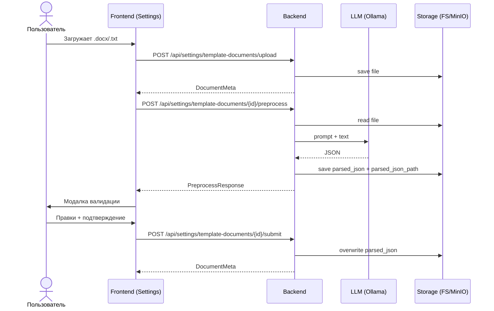
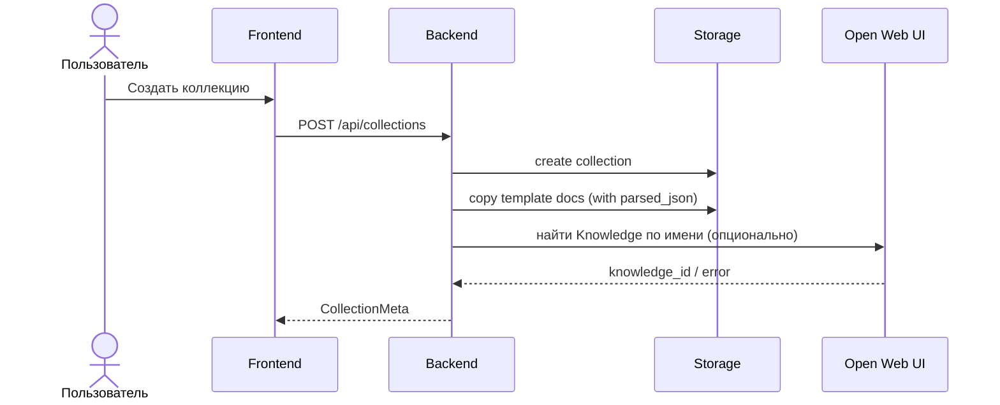
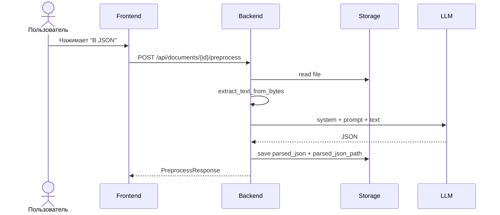
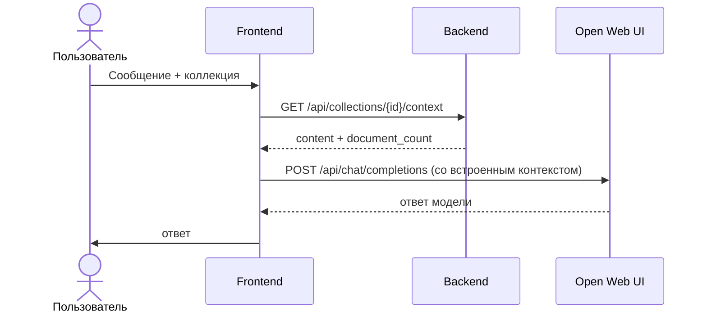
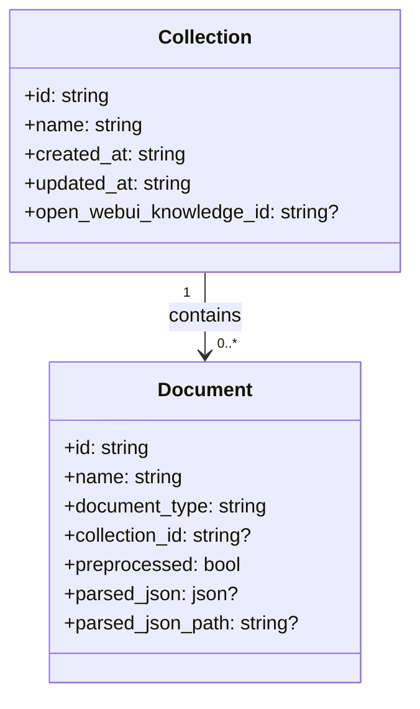

# Архитектура AI KPI

Документ описывает архитектуру всего проекта, бизнес‑логику, потоки данных, ключевые сущности, API и пользовательские сценарии. Содержит актуальное поведение фронтенда и бэкенда.

---

## 1. Назначение продукта

AI KPI — инструмент для:
- ведения базы знаний (документы, чеклисты, регламенты);
- предобработки документов с помощью LLM в структурированный JSON;
- каскадирования целей (от целей руководства к подразделениям);
- работы с таблицами КПЭ/ППР и дашбордами;
- чата с моделью с контекстом из базы знаний.

Проект построен как монорепозиторий с отдельными фронтенд и бэкенд приложениями.

---

## 2. Структура репозитория

```
ai-kpi/
  kpi-agent-front/      # фронтенд (React + Vite)
  kpi-agent-backend/    # бэкенд (FastAPI)
  docs/ARCHITECTURE.md  # этот документ
```

Существуют дополнительные документы в `kpi-agent-front/docs` и `kpi-agent-backend/docs` с алгоритмами и описанием отдельных подсистем.

---

## 3. Компоненты и их роли

### 3.1 Frontend (`kpi-agent-front`)

Роль: UI для работы с таблицами, базой знаний, чатом и настройками.

Ключевые страницы:
- `КПЭ` — таблица KPI, импорт/экспорт, редактирование.
- `ППР` — таблица целей (аналог KPI) с теми же инструментами.
- `База знаний` — создание коллекций, загрузка документов, запуск предобработки.
- `Настройки` — шаблонные документы (Бизнес‑план, Стратегия, Регламент), их предобработка и валидация.
- `Чат` — чат с LLM (Open Web UI), с возможностью прикрепить файлы и коллекции.
- `Дашборды` — визуализация KPI/ППР.

Frontend работает с бэкендом через REST (`VITE_API_URL`) и с Open Web UI напрямую через его API.

### 3.2 Backend (`kpi-agent-backend`)

Роль: API для базы знаний, предобработки документов, управления коллекциями и интеграции с Open Web UI/LLM.

Подключения:
- **MinIO** (опционально) — S3‑совместимое хранилище файлов.
- **Open Web UI** — OpenAI‑совместимый API для чата и (опционально) для предобработки.
- **Ollama** — локальные модели для предобработки и/или каскада.

---

## 4. Основные сущности и модели данных

### 4.1 Типы документов (`DocumentType`)
Используются в базе знаний и промптах:
- `chairman_goals` — цели председателя банка.
- `strategy_checklist` — чеклист стратегии.
- `reglament_checklist` — чеклист регламента.
- `department_goals_checklist` — чеклист целей департамента.
- `business_plan_checklist` — чеклист бизнес‑плана.
- `goals_table` — таблица целей (форма).

### 4.2 Документ (`DocumentMeta`)
Поля (упрощённо):
- `id`, `name`, `document_type`, `collection_id`
- `uploaded_at`, `preprocessed`
- `parsed_json` — результат LLM (опционально)
- `parsed_json_path` — путь/ключ JSON файла в хранилище
- `open_webui_synced`, `open_webui_error`

### 4.3 Коллекция (`CollectionMeta`)
- `id`, `name`, `created_at`, `updated_at`
- `open_webui_knowledge_id` (в `collections.json`, используется для синхронизации в Open Web UI)

### 4.4 JSON‑схемы предобработки

Формы, которые ожидаются на выходе LLM (см. `kpi-agent-backend/src/models/knowledge.py`):

- **Цели председателя (`chairman_goals`)**  
  `period`, `subdivision`, `position`, `goals[]` (id, title, weight_percent, quarters, unit, category).

- **Чеклист стратегии (`strategy_checklist`)**  
  `sections[]`, `items[]` (id, text, section, checked).

- **Чеклист регламента (`reglament_checklist`)**  
  `rules[]` (id, text, section, checked).

- **Чеклист целей департамента (`department_goals_checklist`)**  
  `department`, `goals[]`, `tasks[]` (id, text, section, checked).

- **Чеклист бизнес‑плана (`business_plan_checklist`)**  
  `sections[]`, `items[]` (id, text, section, checked).

- **Таблица целей (`goals_table`)**  
  `subdivision`, `position`, `period`, `rows[]` (goal_number, name, type, kind, unit, кварталы и год).

### 4.5 Табличные данные КПЭ/ППР (frontend)

На фронте таблицы КПЭ и ППР хранятся в LocalStorage и имеют одинаковую структуру строк (`GoalRow`):
`lastName`, `goal`, `metricGoals`, `weightQ`, `weightYear`, `q1..q4`, `year`, `reportYear`.

---

## 5. Хранение данных

### 5.1 Backend (локальная ФС или MinIO)

Файлы и индекс документов:
- `uploads/index.json` — список всех документов (id, имя, тип, путь, `parsed_json`, `preprocessed` и пр.).
- `uploads/collections.json` — коллекции (id, name, даты, open_webui_knowledge_id).
- Если `USE_MINIO=true`: файлы лежат в бакетах по типам документа.

Шаблонные документы:
- коллекция‑шаблон `TEMPLATE_COLLECTION_ID = "__template__"`
- типы: `business_plan_checklist`, `strategy_checklist`, `reglament_checklist`
- эти документы автоматически копируются в каждую новую коллекцию.

JSON‑результаты:
- сохраняются в `parsed_json` в индексе;
- дополнительно пишутся в файл `parsed/{document_id}.json` (в MinIO или локально);
- путь хранится в `parsed_json_path`.

### 5.2 Frontend (LocalStorage)

Ключи:
- `kpi-cascading-kpi-goals` — таблица КПЭ.
- `kpi-cascading-goals` — таблица ППР.
- `kpi-cascading-chats` — история чатов.
- `kpi-cascading-settings` — настройки Open Web UI (url, apiKey).
- `kpi-cascading-uploaded-files` — локальная память о загруженных файлах.
- `kpi-cascading-collections` — локальные коллекции чата (на фронте, не путать с бэкендом).

---

## 6. Логика и потоки данных

### 6.1 Шаблонные документы (Настройки)

1. Пользователь загружает `.docx` или `.txt`.
2. Бэкенд сохраняет файл как документ в коллекции `__template__`.
3. Сразу выполняется предобработка LLM → JSON.
4. UI открывает модалку для проверки и правок.
5. После сохранения JSON хранится в `parsed_json` и `parsed_json_path`.
6. При создании новой коллекции шаблоны копируются вместе с JSON.

### 6.2 Создание коллекции (База знаний)

1. `POST /api/collections` → создаётся коллекция.
2. Бэкенд копирует шаблонные документы (БП/Стратегия/Регламент) в новую коллекцию.
3. Фронтенд загружает остальные документы по слотам.

### 6.3 Предобработка документа

1. Файл читается → `extract_text_from_bytes`.
2. Системный + типовой промпт → `preprocess_document_to_json`.
3. JSON сохраняется в индексе и как отдельный JSON‑файл.

### 6.4 Обработка «Положение о департаменте»

1. Документ типа `department_goals_checklist`.
2. LLM извлекает цели и задачи → JSON.
3. Результат показывается в модалке для ручной валидации.
4. После подтверждения JSON сохраняется.

### 6.5 Генерация JSON‑коллекции

1. `POST /api/collections/{id}/generate-json`.
2. Для каждого документа:
   - если шаблон и JSON уже проверен → копируется JSON;
   - иначе запускается предобработка.
3. Создаётся новая коллекция `{name} (JSON)`.

### 6.6 Чат с моделью

1. Чат отправляется напрямую в Open Web UI (`/api/chat/completions`).
2. Если прикреплены коллекции, фронтенд запрашивает контекст:
   - `GET /api/collections/{id}/context`.
3. Контекст подставляется в последнее сообщение пользователя.

### 6.7 Таблицы КПЭ/ППР

1. Пользователь редактирует таблицу вручную или импортирует `.xlsx`.
2. Данные сохраняются в LocalStorage.
3. Экспорт: CSV, XLSX, HTML, PDF, DOCX.

### 6.8 Дашборды

Дашборды строятся на данных LocalStorage:
- агрегаты по KPI/ППР,
- топ‑цели, метрики, веса и заполненность.

---

## 7. Архитектура бэкенда (модули)

### 7.1 Core
- `core/config.py` — все настройки окружения (LLM, MinIO, таймауты).

### 7.2 Services
- `document_store.py` — индекс документов и коллекций.
- `file_storage.py` — абстракция FS/MinIO.
- `extract_text.py` — извлечение текста из PDF/DOCX/XLSX/TXT.
- `preprocess_prompts.py` — шаблонные промпты для LLM.
- `document_preprocess.py` — общий pipeline предобработки.
- `llm.py` — вызовы Open Web UI / OpenAI / Ollama.
- `open_webui_client.py` — синхронизация файлов в Open Web UI.
- `chat_context.py` — формирование контекста коллекции для чата.

### 7.3 API
- `routes/documents.py` — загрузка, список, предобработка, чеклист департамента.
- `routes/collections.py` — CRUD коллекций, генерация JSON, контекст, sync в OWU.
- `routes/settings.py` — шаблонные документы и их валидация.
- `routes/chat.py` — чат и каскад (через `kpi_agent_core`).
- `routes/dashboard.py` — заглушки под дашборды.

### 7.4 Внешний модуль
- `kpi_agent_core` — внешний пакет с каскадированием (LangGraph).

---

## 8. Архитектура фронтенда (модули)

### 8.1 Страницы
- `KpiPage` — таблица КПЭ.
- `GoalsPage` — таблица ППР.
- `ImportPage` — база знаний, коллекции, обработка документов.
- `SettingsPage` — шаблонные документы.
- `ChatPage` — чат с Open Web UI.
- `DashboardsPage` — аналитика КПЭ/ППР.

### 8.2 Сервисы
- `api/documents.ts` — весь REST к бэкенду.
- `api/openwebui.ts` — прямой доступ к Open Web UI.
- `lib/storage.ts` — локальное хранение.
- `lib/importGoals.ts`, `lib/exportGoals.ts` — импорт/экспорт таблиц.

### 8.3 Компоненты
- `Layout` — меню и основная раскладка.
- `ConfirmModal`, `EditRowModal` — модальные окна для таблиц.
- `TemplateChecklistModal`, `DepartmentChecklistModal` — валидация чеклистов.

---

## 9. API бэкенда (кратко)

### Документы (`/api/documents`)
- `POST /upload`
- `GET /`
- `GET /types`
- `GET /{id}`
- `DELETE /{id}`
- `POST /{id}/preprocess`
- `POST /{id}/process-department-regulation`
- `POST /{id}/submit-department-checklist`

### Коллекции (`/api/collections`)
- `GET /`
- `POST /`
- `GET /{id}`
- `PATCH /{id}`
- `DELETE /{id}`
- `GET /{id}/context`
- `POST /{id}/generate-json`
- `POST /{id}/sync-openwebui`

### Настройки (`/api/settings`)
- `GET /template-documents`
- `POST /template-documents/upload`
- `POST /template-documents/{id}/preprocess`
- `POST /template-documents/{id}/submit`

### Чат (`/api/chat`)
- `POST /completions`
- `POST /cascade`

### Дашборды (`/api/dashboard`)
- `GET /goals` (пока заглушка)
- `GET /metrics` (пока заглушка)

---

## 10. LLM‑архитектура

### 10.1 Предобработка документов
- По умолчанию: **Ollama** (`USE_OLLAMA_FOR_PREPROCESS=true`).
- Модель: `OLLAMA_PREPROCESS_MODEL` (дефолт `qwen3:8b`).
- Таймаут: `OLLAMA_PREPROCESS_TIMEOUT`.

### 10.2 Каскад/итоговая таблица
- По умолчанию: Open Web UI / OpenAI (`LLM_CASCADE_MODEL`).
- Можно переключить на Ollama: `USE_OLLAMA_FOR_CASCADE=true`.

### 10.3 Чат
- Используется Open Web UI через прямой API (на фронте).

---

## 11. Пользовательские истории

### 11.1 Настройки (шаблоны)
**Как администратор** я загружаю Бизнес‑план/Стратегию/Регламент,  
чтобы они автоматически подставлялись в каждую новую коллекцию.

### 11.2 Предобработка
**Как аналитик** я загружаю документ,  
чтобы получить точный JSON чеклиста/целей.

### 11.3 Валидация
**Как пользователь** я проверяю и редактирую JSON после LLM,  
чтобы обеспечить качество и полноту данных.

### 11.4 Генерация коллекции JSON
**Как пользователь** я нажимаю «Сгенерировать JSON»,  
чтобы получить отдельную коллекцию для чата.

### 11.5 Чат с контекстом
**Как пользователь** я прикрепляю коллекцию и задаю вопросы,  
чтобы получать ответы с учётом базы знаний.

### 11.6 КПЭ/ППР
**Как руководитель** я импортирую таблицу KPI/ППР,  
чтобы быстро заполнить систему и построить дашборды.

---

## 12. Конфигурация (ключевые переменные)

Backend `.env`:
- `OPEN_WEBUI_URL`, `OPEN_WEBUI_API_KEY`
- `USE_OLLAMA_FOR_PREPROCESS`, `OLLAMA_PREPROCESS_MODEL`, `OLLAMA_PREPROCESS_TIMEOUT`
- `USE_OLLAMA_FOR_CASCADE`, `OLLAMA_CASCADE_MODEL`, `OLLAMA_CASCADE_TIMEOUT`
- `USE_MINIO`, `MINIO_ENDPOINT`, `MINIO_ACCESS_KEY`, `MINIO_SECRET_KEY`, `MINIO_USE_SSL`
- `LLM_CHAT_MODEL`, `LLM_CASCADE_MODEL`

Frontend:
- `VITE_API_URL` (если не через dev‑proxy)
- в UI чата: `Open Web UI URL` и `API Key`

---

## 13. Ограничения и допущения

- Для шаблонов (БП/Стратегия/Регламент) допустимы только `.docx/.txt`.
- Предобработка зависит от LLM, возможны ошибки парсинга JSON.
- Каскадирование через `kpi_agent_core` — внешний модуль, должен быть установлен отдельно.
- Дашборды на фронте работают только от LocalStorage.

---

## 14. Как расширять систему

Добавление нового типа документа:
1. `DocumentType` + промпт в `preprocess_prompts.py`.
2. Добавить тип в UI (слот на `ImportPage`).
3. Добавить бакет в `DOCUMENT_TYPE_TO_BUCKET`.
4. При необходимости добавить UI для валидации.

---

## 15. Диагностика

- `GET /health` — проверка доступности API.
- Логи LLM/MinIO смотреть в консоли бэкенда.
- Проверка контекста коллекции: `GET /api/collections/{id}/context`.

---

## 16. Диаграммы

### 16.1 Контекст системы

```mermaid
flowchart LR
  U[Пользователь] -->|Браузер| FE[Frontend (React)]
  FE -->|REST /api| BE[Backend (FastAPI)]
  FE -->|Chat API| OWU[Open Web UI]
  BE -->|LLM API| OWU
  BE -->|LLM API| OLL[Ollama]
  BE -->|FS| FS[(Local FS uploads/)]
  BE -->|S3| MINIO[(MinIO)]
```

### 16.2 Жизненный цикл документа

```mermaid
flowchart TD
  Upload[Загрузка файла] --> Store[Сохранение (FS/MinIO)]
  Store --> Index[Запись в индекс (index.json)]
  Index --> Need{Нужна предобработка?}
  Need -->|Да| Extract[Извлечение текста]
  Extract --> LLM[LLM → JSON]
  LLM --> SaveJSON[Сохранение parsed_json + parsed_json_path]
  Need -->|Нет| Ready[Готово к использованию]
  SaveJSON --> Ready
```

### 16.3 Шаблонные документы: загрузка → LLM → валидация



### 16.4 Создание коллекции с копированием шаблонов



### 16.5 Предобработка обычного документа



### 16.6 Чат с контекстом коллекции



### 16.7 Модель данных (упрощённо)



### 16.8 Хранилище данных

```mermaid
flowchart LR
  subgraph Backend
    IDX[index.json]
    COL[collections.json]
  end
  subgraph Files
    RAW[raw file]
    PARSED[parsed/{document_id}.json]
  end
  IDX --> RAW
  IDX --> PARSED
  COL --> IDX
```
